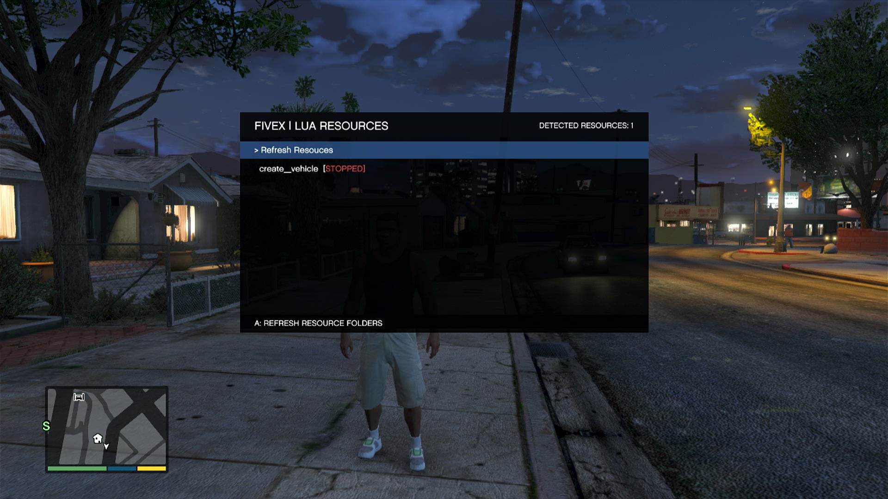
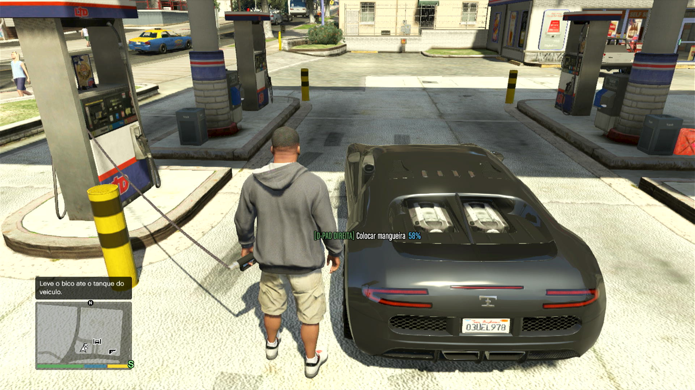

# FiveX

Runtime open source de Lua 5.4.8 para GTA V no Xbox 360.

O FiveX carrega resources Lua diretamente do HDD ou de dispositivos USB do
console. O projeto foi feito para ser uma base pequena e comunitária: ele não é
um mod menu, não possui servidor local e não inclui funções de gameplay.

> **Aviso:** este é um projeto comunitário e experimental, sem vínculo com a
> Rockstar Games, Take-Two Interactive, Microsoft, FiveM ou Cfx.re. Use somente
> em consoles e ambientes nos quais você tenha autorização.

## Screenshot




## Recursos principais

- Lua 5.4.8 embutido no XEX;
- leitura simultânea de resources no HDD, `Usb0` e `Usb1`;
- interface in-game para atualizar, iniciar e parar resources;
- auto-start persistente por resource, configurado diretamente no menu;
- estados visíveis no menu: `STOPPED`, `STARTED` e `FAILED`;
- scheduler com `CreateThread`, `Wait` e `SetTimeout`;
- eventos, dependências e exports entre resources;
- `vector3`/`vec3` e catálogo de natives com assinaturas FiveM, filtrado pelos handlers disponíveis no Xbox 360;
- isolamento de memória e limite de instruções por resource;
- encerramento automático de uma resource em execução quando sua pasta é
  removida e o usuário seleciona **Refresh Resouces**.

## O que o FiveX não inclui

- servidor local ou remoto;
- scripts server-side, OneSync, NUI, state bags ou APIs internas do FiveM;
- funções de recovery, mod menu ou cheats prontas;
- sistema de download/sincronização de resources;
- opção de descarregar o próprio FiveX durante o jogo.

## Requisitos

- Xbox 360 capaz de carregar plugins/XEX não oficiais;
- GTA V para Xbox 360 com Title ID `545408A7`;
- um loader/dashboard compatível para carregar `FiveX.xex` como plugin;
- para compilar: Xbox 360 XDK com o toolset `2010-01` e Visual Studio/MSBuild
  compatível.

O runtime usa endereços específicos da versão Xbox 360 do GTA V. Caso seu
executável ou Title Update tenha código diferente, revise os endereços e
patches antes de usar. Um endereço incompatível pode travar o jogo ou o
console.

## Instalação no console

1. Baixe `FiveX.xex` na página de Releases do projeto ou compile a source.
2. Copie o XEX para uma pasta permanente no HDD do console.
3. Configure seu loader/dashboard para carregar o XEX como plugin.
4. Crie uma pasta de resources em pelo menos um dos caminhos abaixo:

   ```text
   Hdd:\FiveX\Resources
   Usb0:\FiveX\Resources
   Usb1:\FiveX\Resources
   ```

   A pasta do HDD é criada automaticamente quando o FiveX inicializa. Em USB,
   o dispositivo precisa estar montado e a pasta `FiveX\Resources` precisa
   existir.

5. Coloque cada resource em sua própria subpasta.
6. Inicie o GTA V. O FiveX aguarda o jogo e o dispatcher de scripts estarem
   estáveis antes de inicializar o runtime.

O nome de cada resource deve ser único entre todos os dispositivos. Quando o
mesmo nome existe em mais de um local, a primeira cópia encontrada na ordem
HDD, `Usb0`, `Usb1` é usada.

## Controles do menu

| Controle | Ação |
| --- | --- |
| `RB + X` | Abrir ou fechar o menu |
| D-pad para cima/baixo | Navegar |
| `A` sobre **Refresh Resouces** | Ler novamente as pastas |
| `A` sobre uma resource parada | Iniciar |
| `A` sobre uma resource ativa | Parar |
| `X` sobre uma resource | Ativar ou desativar o auto-start |

Enquanto o menu está aberto, os controles do GTA são bloqueados para evitar
ações acidentais como abrir o celular.

Resources marcadas exibem `AUTO-START` em amarelo. A seleção é salva em
`Hdd:\FiveX\FiveX.ini` e aplicada somente durante a inicialização do FiveX,
depois que o estado `COMBINED_READY` do jogo permanece estável. Atualizar as
pastas pelo menu não inicia automaticamente uma resource marcada.

## Criando a primeira resource

Estrutura mínima:

```text
FiveX\Resources\hello_fivex\
├── fxmanifest.lua
└── client.lua
```

`fxmanifest.lua`:

```lua
fx_version 'cerulean'
game 'gta5'

client_script 'client.lua'
```

`client.lua`:

```lua
AddEventHandler('onResourceStart', function(resourceName)
    if resourceName ~= GetCurrentResourceName() then return end
    print('Hello from ' .. resourceName)
end)

CreateThread(function()
    while true do
        Wait(1000)
        -- Seu código aqui.
    end
end)
```

Copie a pasta para um dos diretórios suportados, abra o menu, execute
**Refresh Resouces** e selecione `hello_fivex` para iniciar. As chamadas de
`print(...)` aparecem como notificações do próprio GTA V.

O guia completo de manifests, ciclo de vida, exports, eventos, natives e
limites está em [LUA_RESOURCES.md](LUA_RESOURCES.md).

Uma resource mínima pronta para copiar também está em
[`Examples/hello_fivex`](Examples/hello_fivex).

O exemplo [`Examples/dolla_fuel`](Examples/dolla_fuel) demonstra
um sistema completo de combustível com bomba, bico e mangueira física no Xbox
360. Ele também serve como referência para as bindings seguras de rope.

O exemplo [`Examples/drawhud`](Examples/drawhud) demonstra uma HUD configurável
feita somente com `DrawSprite`, `DrawRect` e `DrawText`, sem HTML.

## Compilando a source

1. Instale e configure legalmente o Xbox 360 XDK.
2. Abra `FiveX.sln` em um ambiente compatível com projetos Xbox 360.
3. Selecione a configuração `Release` e a plataforma `Xbox 360`.
4. Compile a solution.

O resultado é gerado em:

```text
Compiled\FiveX.xex
```

O projeto usa `/dll`, o entry point `FiveXEntry`, base `0x91D00000` e as
bibliotecas `xapilib.lib`, `xboxkrnl.lib` e `libcmt.lib`.


## Organização do projeto

```text
Core/                 Entrada, armazenamento, input e notificações
Examples/             Resources pequenas usadas como referência
Runtime/Lua/          Runtime, catálogo de natives e gerenciamento de resources
ThirdParty/Lua54/     Lua 5.4.8 adaptado para o toolchain Xbox 360
Tools/                Metadados FiveM e gerador independente do catálogo Lua
CoreNatives.h         Wrappers tipados usados somente pelo núcleo C++
FiveXMenu.cpp         Interface in-game
Main.cpp              Entrada do XEX, detecção do GTA e patches de compatibilidade
```

## Créditos e componentes de terceiros

- **Dolla** — criador, autor e mantenedor do FiveX;
- **OpenAI Codex** — assistência no desenvolvimento, revisão da source e
  documentação do projeto;
- [Lua 5.4.8](https://www.lua.org/) — licença incluída em
  `ThirdParty/Lua54/lua.h`;
- metadados de natives derivados das referências registradas em
  `ThirdParty/Lua54/README_FIVEX.md` e `Tools/NativeMetadata`.

Preserve os avisos de copyright e as licenças dos componentes de terceiros ao
redistribuir a source ou binários.

## Licença

O FiveX é distribuído sob a [MIT License](LICENSE). Você pode usar, modificar e
redistribuir o código, desde que preserve o aviso de copyright e a licença.

O código ser open source não concede permissão para publicar commits no
repositório oficial. Somente Dolla mantém e publica alterações oficiais. Forks
independentes continuam sujeitos aos termos da licença MIT.
